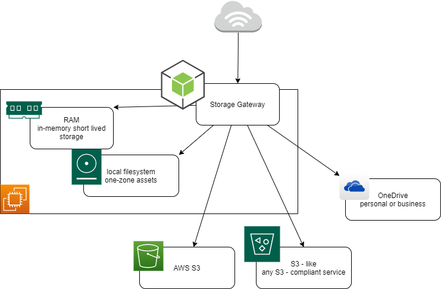

# storage-gateway

This applications provides an API for object storage, leveraging multiple different storage services and providing features like metadata, thumbnails, encryption, upload sessions and more.

## Features

Currently supported features:

- Store different buckets on different storage services, transparently, with the same API
- Store on Amazon S3 and every S3-compliant storage services (GCP, Oracle, IBM, BackBlaze, ...)
- Store on MinIO for self-provisioned storage backend (S3 compliant)
- Store in personal or business OneDrive accounts (1TB provided with Office365 plans)
- Store on local filesystem (for reduced-redundancy, recoverable assets)
- Store in local RAM (intendend for caching)
- Store arbitrary metadata on every asset
- Extract metadata from image and videos
- Generate thumbnails from images
- SHA1, SHA256 and legacy MD5 hash check for upload verifications
- Support partial/ranged and conditional requests with proper ETag management
- Encryption at-rest with AES-256, compatible with partial/ranged requests with AES-256-GCM
- Multipart Upload sessions
- Bucket and object-level ACL
- Support for sharing at object-level
- Direct embed and download link generation
- Immediate consistency on all operations for all storage backends
- Async cleanup jobs
- Comes with Java client for Spring and NodeJS client generators



Incoming features:

- Expose S3 compliant API

## Loopback

This application is generated using [LoopBack 4 CLI](https://loopback.io/doc/en/lb4/Command-line-interface.html) with the
[initial project layout](https://loopback.io/doc/en/lb4/Loopback-application-layout.html).

## Install dependencies

By default, dependencies were installed when this application was generated.
Whenever dependencies in `package.json` are changed, run the following command:

```sh
npm install
```

To only install resolved dependencies in `package-lock.json`:

```sh
npm ci
```

## Run the application

```sh
npm start
```

You can also run `node .` to skip the build step.

Open http://127.0.0.1:3000 in your browser.

## Rebuild the project

To incrementally build the project:

```sh
npm run build
```

To force a full build by cleaning up cached artifacts:

```sh
npm run clean
npm run build
```

## Fix code style and formatting issues

If `eslint` and `prettier` are enabled for this project, you can use the
following commands to check code style and formatting issues.

```sh
npm run lint
```

To automatically fix such issues:

```sh
npm run lint:fix
```

## Other useful commands

- `npm run migrate`: Migrate database schemas for models
- `npm run openapi-spec`: Generate OpenAPI spec into a file
- `npm run docker:build`: Build a Docker image for this application
- `npm run docker:run`: Run this application inside a Docker container

## Tests

```sh
npm test
```

## What's next

Please check out [LoopBack 4 documentation](https://loopback.io/doc/en/lb4/) to
understand how you can continue to add features to this application.

[-@2x.png>)](http://loopback.io/)
